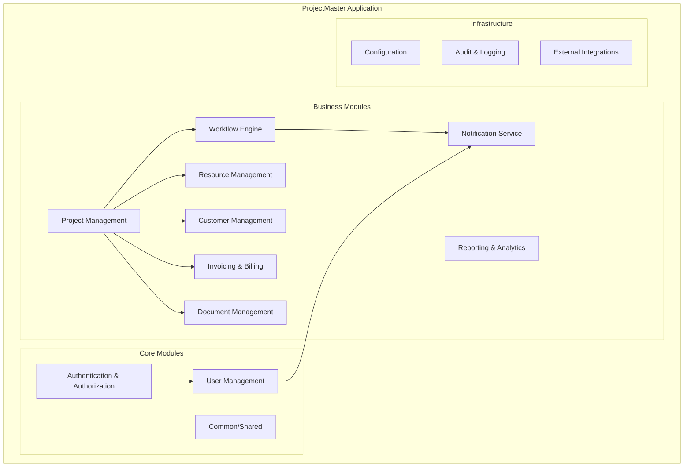
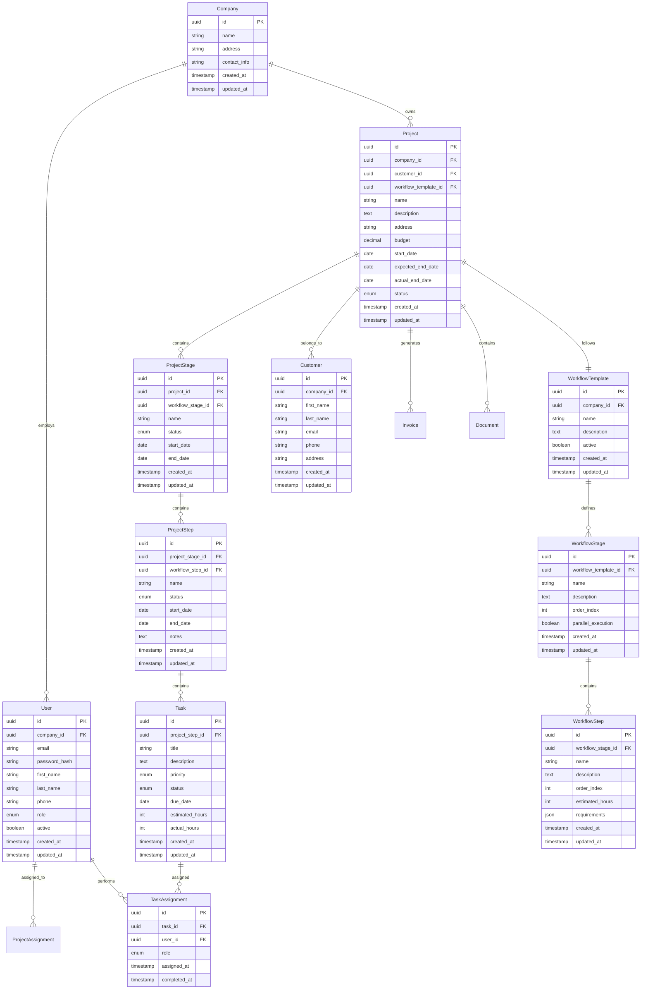
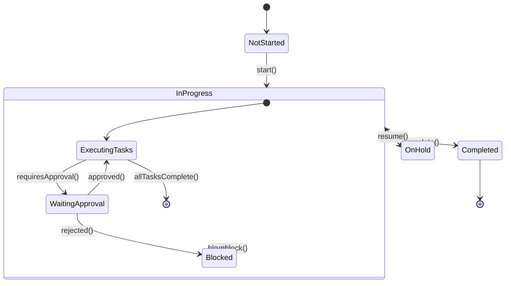

# ProjectMaster - Residential Construction Management System
## Architecture Design Document

## 1. System Overview

ProjectMaster is a modular monolith application designed for residential construction companies to manage projects, tradies, customers, and workflows. Built with Spring Boot and PostgreSQL, it provides a flexible workflow engine that can accommodate various construction processes.

### 1.1 Key Requirements
- **Flexible Workflow Management**: Configurable stages and steps for different construction processes
- **Multi-Role Support**: Admin, Project Managers, Tradies/Workers, Customers
- **Real-time Updates**: Progress tracking and notifications
- **Document Management**: File uploads, photos, and document storage
- **Invoicing & Billing**: Financial management capabilities
- **Mobile-Friendly**: Support for field workers

## 2. Architectural Principles

### 2.1 Modular Monolith
- **Domain-Driven Design**: Clear module boundaries based on business domains
- **Loose Coupling**: Modules communicate through well-defined interfaces
- **High Cohesion**: Related functionality grouped within modules
- **Event-Driven**: Asynchronous communication between modules

### 2.2 Technology Stack
- **Backend**: Java 21, Spring Boot 3.5.3
- **Database**: PostgreSQL with JPA/Hibernate
- **Security**: Spring Security with JWT
- **Documentation**: OpenAPI/Swagger
- **Testing**: JUnit 5, Testcontainers
- **Build**: Maven

## 3. Module Architecture



### 3.1 Module Descriptions

#### Core Modules

**Authentication & Authorization Module**
- JWT-based authentication
- Role-based access control (RBAC)
- Permission management
- Session management

**User Management Module**
- User profiles and preferences
- Role assignment
- Company/organization management
- User activity tracking

**Common/Shared Module**
- Base entities and DTOs
- Common utilities and helpers
- Exception handling
- Validation frameworks

#### Business Modules

**Project Management Module**
- Project lifecycle management
- Project templates
- Resource allocation
- Timeline management
- Budget tracking

**Workflow Engine Module**
- Configurable workflow definitions
- Stage and step management
- State transitions and validations
- Conditional logic support
- Parallel and sequential task execution

**Resource Management Module**
- Tradie/worker management
- Skill and certification tracking
- Availability scheduling
- Equipment and material management

**Customer Management Module**
- Customer profiles and contacts
- Communication history
- Approval workflows
- Customer portal access

**Invoicing & Billing Module**
- Invoice generation and management
- Payment tracking
- Cost estimation
- Financial reporting

**Notification Service Module**
- Multi-channel notifications (email, SMS, push)
- Event-driven messaging
- Notification templates
- Delivery tracking

**Document Management Module**
- File upload and storage
- Document versioning
- Access control
- Integration with cloud storage

**Reporting & Analytics Module**
- Dashboard and KPIs
- Custom report generation
- Data visualization
- Performance metrics

#### Infrastructure Modules

**Configuration Module**
- Environment-specific settings
- Feature flags
- System parameters

**Audit & Logging Module**
- Activity logging
- Change tracking
- Compliance reporting

**Integration Module**
- Third-party API integrations
- Webhook management
- Data synchronization

## 4. Domain Model Design

### 4.1 Core Entities



### 4.2 Status Enums

**Project Status**: PLANNING, IN_PROGRESS, ON_HOLD, COMPLETED, CANCELLED
**Stage Status**: NOT_STARTED, IN_PROGRESS, COMPLETED, BLOCKED
**Step Status**: NOT_STARTED, IN_PROGRESS, COMPLETED, SKIPPED, BLOCKED
**Task Status**: OPEN, IN_PROGRESS, COMPLETED, CANCELLED
**User Role**: ADMIN, PROJECT_MANAGER, TRADIE, CUSTOMER
**Task Priority**: LOW, MEDIUM, HIGH, URGENT

## 5. Workflow Engine Design

### 5.1 Flexible Workflow Architecture

The workflow engine supports:
- **Template-based workflows**: Reusable workflow definitions
- **Dynamic stage/step creation**: Runtime workflow modifications
- **Conditional logic**: Rules-based progression
- **Parallel execution**: Concurrent stages/steps
- **Approval gates**: Customer/manager approvals
- **Rollback capabilities**: Undo completed steps

### 5.2 Workflow State Machine



## 6. API Design

### 6.1 RESTful API Structure

**Base URL**: `/api/v1`

#### Authentication Endpoints
- `POST /auth/login` - User authentication
- `POST /auth/refresh` - Token refresh
- `POST /auth/logout` - User logout

#### Project Management
- `GET /projects` - List projects
- `POST /projects` - Create project
- `GET /projects/{id}` - Get project details
- `PUT /projects/{id}` - Update project
- `DELETE /projects/{id}` - Delete project

#### Workflow Management
- `GET /projects/{id}/stages` - Get project stages
- `POST /projects/{id}/stages/{stageId}/start` - Start stage
- `POST /projects/{id}/stages/{stageId}/complete` - Complete stage
- `GET /projects/{id}/steps` - Get project steps
- `PUT /projects/{id}/steps/{stepId}` - Update step status

#### Task Management
- `GET /tasks` - List assigned tasks
- `PUT /tasks/{id}` - Update task
- `POST /tasks/{id}/time` - Log time
- `POST /tasks/{id}/photos` - Upload photos

#### User Management
- `GET /users` - List users (Admin only)
- `POST /users` - Create user (Admin only)
- `GET /users/profile` - Get current user profile
- `PUT /users/profile` - Update profile

### 6.2 API Response Format

```json
{
  "success": true,
  "data": {},
  "message": "Operation completed successfully",
  "timestamp": "2025-01-07T07:16:00Z",
  "errors": []
}
```

## 7. Security Architecture

### 7.1 Authentication & Authorization
- **JWT Tokens**: Stateless authentication
- **Role-Based Access Control**: Fine-grained permissions
- **API Rate Limiting**: Prevent abuse
- **CORS Configuration**: Cross-origin security

### 7.2 Data Security
- **Password Encryption**: BCrypt hashing
- **Data Encryption**: Sensitive data at rest
- **Audit Logging**: All user actions tracked
- **Input Validation**: Prevent injection attacks

## 8. Database Design

### 8.1 PostgreSQL Optimization
- **Indexing Strategy**: Optimized for common queries
- **Partitioning**: Large tables by date/company
- **Connection Pooling**: HikariCP configuration
- **Read Replicas**: Future scalability

### 8.2 Data Archival
- **Soft Deletes**: Maintain data integrity
- **Audit Tables**: Change history tracking
- **Backup Strategy**: Regular automated backups

## 9. Event-Driven Architecture

### 9.1 Domain Events
- ProjectCreated, ProjectCompleted
- StageStarted, StageCompleted
- TaskAssigned, TaskCompleted
- UserRegistered, UserDeactivated

### 9.2 Event Handling
- **Spring Application Events**: Internal communication
- **Async Processing**: Non-blocking operations
- **Event Sourcing**: Future consideration for audit trail

## 10. Package Structure

```
com.projectmaster.app/
├── common/                     # Shared utilities and base classes
│   ├── entity/                # Base entities
│   ├── dto/                   # Common DTOs
│   ├── exception/             # Exception handling
│   ├── util/                  # Utility classes
│   └── validation/            # Custom validators
├── config/                    # Configuration classes
│   ├── security/              # Security configuration
│   ├── database/              # Database configuration
│   └── web/                   # Web configuration
├── auth/                      # Authentication & Authorization
│   ├── controller/
│   ├── service/
│   ├── entity/
│   └── dto/
├── user/                      # User Management
│   ├── controller/
│   ├── service/
│   ├── repository/
│   ├── entity/
│   └── dto/
├── project/                   # Project Management
│   ├── controller/
│   ├── service/
│   ├── repository/
│   ├── entity/
│   └── dto/
├── workflow/                  # Workflow Engine
│   ├── controller/
│   ├── service/
│   ├── repository/
│   ├── entity/
│   ├── dto/
│   └── engine/               # Workflow execution engine
├── resource/                  # Resource Management
│   ├── controller/
│   ├── service/
│   ├── repository/
│   ├── entity/
│   └── dto/
├── customer/                  # Customer Management
│   ├── controller/
│   ├── service/
│   ├── repository/
│   ├── entity/
│   └── dto/
├── invoice/                   # Invoicing & Billing
│   ├── controller/
│   ├── service/
│   ├── repository/
│   ├── entity/
│   └── dto/
├── notification/              # Notification Service
│   ├── service/
│   ├── entity/
│   ├── dto/
│   └── provider/             # Email, SMS providers
├── document/                  # Document Management
│   ├── controller/
│   ├── service/
│   ├── repository/
│   ├── entity/
│   └── storage/              # File storage handlers
├── reporting/                 # Reporting & Analytics
│   ├── controller/
│   ├── service/
│   ├── repository/
│   └── dto/
└── integration/               # External Integrations
    ├── webhook/
    ├── api/
    └── sync/
```

## 11. Development Guidelines

### 11.1 Code Standards
- **Clean Architecture**: Separation of concerns
- **SOLID Principles**: Maintainable code design
- **Test-Driven Development**: Comprehensive test coverage
- **Code Reviews**: Mandatory peer reviews

### 11.2 Documentation
- **API Documentation**: OpenAPI/Swagger
- **Code Documentation**: Javadoc comments
- **Architecture Decision Records**: Document key decisions

## 12. Deployment Strategy

### 12.1 Environment Configuration
- **Development**: Local PostgreSQL, embedded testing
- **Staging**: Docker containers, cloud database
- **Production**: Kubernetes deployment, managed database

### 12.2 CI/CD Pipeline
- **Build**: Maven compilation and testing
- **Quality Gates**: SonarQube analysis
- **Deployment**: Automated deployment to environments
- **Monitoring**: Application performance monitoring

## 13. Future Considerations

### 13.1 Scalability
- **Microservices Migration**: Module extraction strategy
- **Caching Layer**: Redis for performance
- **Message Queue**: RabbitMQ/Apache Kafka for async processing

### 13.2 Mobile Support
- **REST API**: Mobile app integration
- **Push Notifications**: Real-time updates
- **Offline Capability**: Local data synchronization

This architecture provides a solid foundation for your residential construction management system with the flexibility to evolve as your business requirements grow.