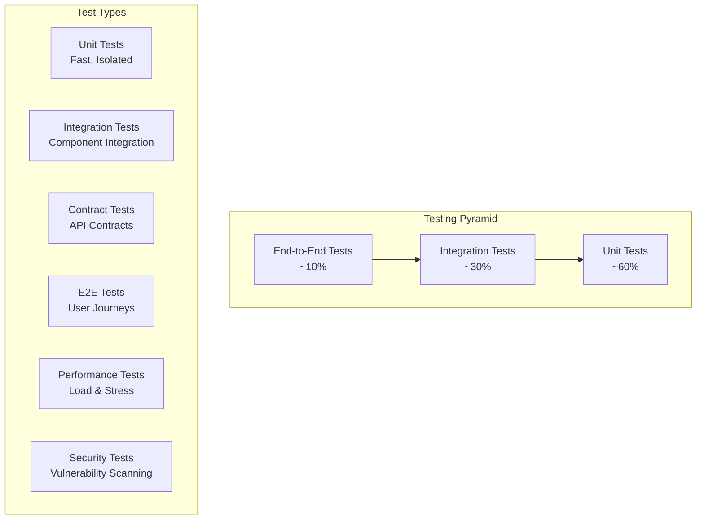

# ProjectMaster Testing Strategy

## 1. Testing Overview

This document outlines the comprehensive testing strategy for the ProjectMaster residential construction management system. The strategy covers unit testing, integration testing, end-to-end testing, and performance testing.

## 2. Testing Pyramid



## 3. Testing Framework Setup

### 3.1 Dependencies

Add to [`pom.xml`](pom.xml):

```xml
<dependencies>
    <!-- Testing Dependencies -->
    <dependency>
        <groupId>org.springframework.boot</groupId>
        <artifactId>spring-boot-starter-test</artifactId>
        <scope>test</scope>
    </dependency>
    
    <!-- Testcontainers for Integration Testing -->
    <dependency>
        <groupId>org.testcontainers</groupId>
        <artifactId>junit-jupiter</artifactId>
        <scope>test</scope>
    </dependency>
    <dependency>
        <groupId>org.testcontainers</groupId>
        <artifactId>postgresql</artifactId>
        <scope>test</scope>
    </dependency>
    
    <!-- MockWebServer for API Testing -->
    <dependency>
        <groupId>com.squareup.okhttp3</groupId>
        <artifactId>mockwebserver</artifactId>
        <scope>test</scope>
    </dependency>
    
    <!-- WireMock for Service Mocking -->
    <dependency>
        <groupId>com.github.tomakehurst</groupId>
        <artifactId>wiremock-jre8</artifactId>
        <scope>test</scope>
    </dependency>
    
    <!-- AssertJ for Fluent Assertions -->
    <dependency>
        <groupId>org.assertj</groupId>
        <artifactId>assertj-core</artifactId>
        <scope>test</scope>
    </dependency>
    
    <!-- Awaitility for Async Testing -->
    <dependency>
        <groupId>org.awaitility</groupId>
        <artifactId>awaitility</artifactId>
        <scope>test</scope>
    </dependency>
</dependencies>
```

### 3.2 Test Configuration

```java
// Base test configuration
@TestConfiguration
public class TestConfig {
    
    @Bean
    @Primary
    public Clock testClock() {
        return Clock.fixed(Instant.parse("2025-01-07T10:00:00Z"), ZoneOffset.UTC);
    }
    
    @Bean
    @Primary
    public NotificationService mockNotificationService() {
        return Mockito.mock(NotificationService.class);
    }
}

// Test application properties
@TestPropertySource(properties = {
    "spring.datasource.url=jdbc:h2:mem:testdb",
    "spring.jpa.hibernate.ddl-auto=create-drop",
    "logging.level.com.projectmaster=DEBUG",
    "app.notification.enabled=false"
})
```

## 4. Unit Testing Strategy

### 4.1 Service Layer Testing

```java
@ExtendWith(MockitoExtension.class)
class ProjectServiceTest {
    
    @Mock
    private ProjectRepository projectRepository;
    
    @Mock
    private WorkflowTemplateRepository workflowTemplateRepository;
    
    @Mock
    private EventPublisher eventPublisher;
    
    @InjectMocks
    private ProjectService projectService;
    
    @Test
    @DisplayName("Should create project with valid data")
    void shouldCreateProjectWithValidData() {
        // Given
        CreateProjectRequest request = CreateProjectRequest.builder()
            .name("Test Project")
            .customerId(UUID.randomUUID())
            .workflowTemplateId(UUID.randomUUID())
            .budget(BigDecimal.valueOf(100000))
            .build();
        
        WorkflowTemplate template = createMockWorkflowTemplate();
        Project savedProject = createMockProject();
        
        when(workflowTemplateRepository.findById(request.getWorkflowTemplateId()))
            .thenReturn(Optional.of(template));
        when(projectRepository.save(any(Project.class)))
            .thenReturn(savedProject);
        
        // When
        ProjectDto result = projectService.createProject(request);
        
        // Then
        assertThat(result).isNotNull();
        assertThat(result.getName()).isEqualTo("Test Project");
        verify(eventPublisher).publishEvent(any(ProjectCreatedEvent.class));
    }
    
    @Test
    @DisplayName("Should throw exception when workflow template not found")
    void shouldThrowExceptionWhenWorkflowTemplateNotFound() {
        // Given
        CreateProjectRequest request = CreateProjectRequest.builder()
            .workflowTemplateId(UUID.randomUUID())
            .build();
        
        when(workflowTemplateRepository.findById(request.getWorkflowTemplateId()))
            .thenReturn(Optional.empty());
        
        // When & Then
        assertThatThrownBy(() -> projectService.createProject(request))
            .isInstanceOf(EntityNotFoundException.class)
            .hasMessage("Workflow template not found");
    }
}
```

### 4.2 Repository Testing

```java
@DataJpaTest
@Testcontainers
class ProjectRepositoryTest {
    
    @Container
    static PostgreSQLContainer<?> postgres = new PostgreSQLContainer<>("postgres:15")
            .withDatabaseName("testdb")
            .withUsername("test")
            .withPassword("test");
    
    @Autowired
    private TestEntityManager entityManager;
    
    @Autowired
    private ProjectRepository projectRepository;
    
    @DynamicPropertySource
    static void configureProperties(DynamicPropertyRegistry registry) {
        registry.add("spring.datasource.url", postgres::getJdbcUrl);
        registry.add("spring.datasource.username", postgres::getUsername);
        registry.add("spring.datasource.password", postgres::getPassword);
    }
    
    @Test
    @DisplayName("Should find projects by status")
    void shouldFindProjectsByStatus() {
        // Given
        Company company = createAndPersistCompany();
        Customer customer = createAndPersistCustomer(company);
        WorkflowTemplate template = createAndPersistWorkflowTemplate(company);
        
        Project activeProject = createProject("Active Project", ProjectStatus.IN_PROGRESS, 
                                            company, customer, template);
        Project completedProject = createProject("Completed Project", ProjectStatus.COMPLETED, 
                                                company, customer, template);
        
        entityManager.persistAndFlush(activeProject);
        entityManager.persistAndFlush(completedProject);
        
        // When
        List<Project> activeProjects = projectRepository.findByStatus(ProjectStatus.IN_PROGRESS);
        
        // Then
        assertThat(activeProjects).hasSize(1);
        assertThat(activeProjects.get(0).getName()).isEqualTo("Active Project");
    }
}
```

### 4.3 Workflow Engine Testing

```java
@ExtendWith(MockitoExtension.class)
class WorkflowEngineTest {
    
    @Mock
    private WorkflowExecutor workflowExecutor;
    
    @Mock
    private StateManager stateManager;
    
    @Mock
    private RuleEngine ruleEngine;
    
    @InjectMocks
    private WorkflowEngine workflowEngine;
    
    @Test
    @DisplayName("Should execute workflow successfully")
    void shouldExecuteWorkflowSuccessfully() {
        // Given
        WorkflowExecutionRequest request = createWorkflowExecutionRequest();
        WorkflowExecutionContext context = createWorkflowExecutionContext();
        WorkflowExecutionResult expectedResult = createSuccessfulResult();
        
        when(ruleEngine.evaluateTransitionRules(any(), any())).thenReturn(true);
        when(workflowExecutor.execute(any())).thenReturn(expectedResult);
        
        // When
        WorkflowExecutionResult result = workflowEngine.executeWorkflow(request);
        
        // Then
        assertThat(result.isSuccess()).isTrue();
        verify(stateManager).updateState(any(), eq(expectedResult));
    }
    
    @Test
    @DisplayName("Should block workflow when rules fail")
    void shouldBlockWorkflowWhenRulesFail() {
        // Given
        WorkflowExecutionRequest request = createWorkflowExecutionRequest();
        
        when(ruleEngine.evaluateTransitionRules(any(), any())).thenReturn(false);
        when(ruleEngine.getBlockingRules(any(), any()))
            .thenReturn(List.of(new SequentialStageRule()));
        
        // When & Then
        assertThatThrownBy(() -> workflowEngine.executeWorkflow(request))
            .isInstanceOf(WorkflowValidationException.class);
    }
}
```

## 5. Integration Testing Strategy

### 5.1 Web Layer Integration Tests

```java
@SpringBootTest(webEnvironment = SpringBootTest.WebEnvironment.RANDOM_PORT)
@Testcontainers
@AutoConfigureTestDatabase(replace = AutoConfigureTestDatabase.Replace.NONE)
class ProjectControllerIntegrationTest {
    
    @Container
    static PostgreSQLContainer<?> postgres = new PostgreSQLContainer<>("postgres:15");
    
    @Autowired
    private TestRestTemplate restTemplate;
    
    @Autowired
    private ProjectRepository projectRepository;
    
    @Autowired
    private JwtTokenProvider jwtTokenProvider;
    
    private String authToken;
    
    @BeforeEach
    void setUp() {
        authToken = jwtTokenProvider.generateToken(createTestUser());
    }
    
    @Test
    @DisplayName("Should create project via REST API")
    void shouldCreateProjectViaRestApi() {
        // Given
        CreateProjectRequest request = CreateProjectRequest.builder()
            .name("Integration Test Project")
            .customerId(createTestCustomer().getId())
            .workflowTemplateId(createTestWorkflowTemplate().getId())
            .budget(BigDecimal.valueOf(150000))
            .build();
        
        HttpHeaders headers = new HttpHeaders();
        headers.setBearerAuth(authToken);
        HttpEntity<CreateProjectRequest> entity = new HttpEntity<>(request, headers);
        
        // When
        ResponseEntity<ApiResponse<ProjectDto>> response = restTemplate.exchange(
            "/api/v1/projects",
            HttpMethod.POST,
            entity,
            new ParameterizedTypeReference<ApiResponse<ProjectDto>>() {}
        );
        
        // Then
        assertThat(response.getStatusCode()).isEqualTo(HttpStatus.CREATED);
        assertThat(response.getBody().isSuccess()).isTrue();
        assertThat(response.getBody().getData().getName()).isEqualTo("Integration Test Project");
        
        // Verify database state
        List<Project> projects = projectRepository.findAll();
        assertThat(projects).hasSize(1);
        assertThat(projects.get(0).getName()).isEqualTo("Integration Test Project");
    }
}
```

### 5.2 Database Integration Tests

```java
@SpringBootTest
@Testcontainers
@Transactional
class WorkflowIntegrationTest {
    
    @Container
    static PostgreSQLContainer<?> postgres = new PostgreSQLContainer<>("postgres:15");
    
    @Autowired
    private WorkflowEngine workflowEngine;
    
    @Autowired
    private ProjectRepository projectRepository;
    
    @Autowired
    private ProjectStageRepository projectStageRepository;
    
    @Test
    @DisplayName("Should complete full workflow execution")
    void shouldCompleteFullWorkflowExecution() {
        // Given
        Project project = createTestProjectWithStages();
        projectRepository.save(project);
        
        ProjectStage firstStage = project.getStages().get(0);
        
        // When - Start first stage
        WorkflowExecutionRequest startRequest = WorkflowExecutionRequest.builder()
            .projectId(project.getId())
            .stageId(firstStage.getId())
            .action(WorkflowAction.START_STAGE)
            .userId(createTestUser().getId())
            .build();
        
        WorkflowExecutionResult startResult = workflowEngine.executeWorkflow(startRequest);
        
        // Then
        assertThat(startResult.isSuccess()).isTrue();
        
        // Verify database state
        ProjectStage updatedStage = projectStageRepository.findById(firstStage.getId()).orElseThrow();
        assertThat(updatedStage.getStatus()).isEqualTo(StageStatus.IN_PROGRESS);
        assertThat(updatedStage.getActualStartDate()).isNotNull();
    }
}
```

## 6. End-to-End Testing Strategy

### 6.1 User Journey Tests

```java
@SpringBootTest(webEnvironment = SpringBootTest.WebEnvironment.RANDOM_PORT)
@Testcontainers
class ProjectManagementE2ETest {
    
    @Container
    static PostgreSQLContainer<?> postgres = new PostgreSQLContainer<>("postgres:15");
    
    @Autowired
    private TestRestTemplate restTemplate;
    
    @Test
    @DisplayName("Complete project lifecycle - from creation to completion")
    void completeProjectLifecycle() {
        // 1. Login as Project Manager
        String pmToken = loginAsProjectManager();
        
        // 2. Create Customer
        CustomerDto customer = createCustomer(pmToken);
        
        // 3. Create Project
        ProjectDto project = createProject(pmToken, customer.getId());
        
        // 4. Start first stage
        startProjectStage(pmToken, project.getId(), getFirstStageId(project));
        
        // 5. Create and assign tasks
        TaskDto task = createTask(pmToken, project.getId());
        assignTask(pmToken, task.getId(), getTradieUserId());
        
        // 6. Login as Tradie and complete task
        String tradieToken = loginAsTradie();
        completeTask(tradieToken, task.getId());
        
        // 7. Complete stage as PM
        completeStage(pmToken, project.getId(), getFirstStageId(project));
        
        // 8. Verify project progress
        ProjectDto updatedProject = getProject(pmToken, project.getId());
        assertThat(updatedProject.getProgressPercentage()).isGreaterThan(0);
    }
    
    private String loginAsProjectManager() {
        LoginRequest request = new LoginRequest("pm@test.com", "password");
        ResponseEntity<ApiResponse<AuthResponse>> response = restTemplate.postForEntity(
            "/api/v1/auth/login", request, 
            new ParameterizedTypeReference<ApiResponse<AuthResponse>>() {}
        );
        return response.getBody().getData().getToken();
    }
}
```

## 7. Performance Testing Strategy

### 7.1 Load Testing Configuration

```java
@SpringBootTest(webEnvironment = SpringBootTest.WebEnvironment.RANDOM_PORT)
@Testcontainers
class PerformanceTest {
    
    @Test
    @DisplayName("Should handle concurrent project creation")
    void shouldHandleConcurrentProjectCreation() throws InterruptedException {
        int numberOfThreads = 10;
        int projectsPerThread = 5;
        ExecutorService executor = Executors.newFixedThreadPool(numberOfThreads);
        CountDownLatch latch = new CountDownLatch(numberOfThreads);
        AtomicInteger successCount = new AtomicInteger(0);
        AtomicInteger errorCount = new AtomicInteger(0);
        
        for (int i = 0; i < numberOfThreads; i++) {
            executor.submit(() -> {
                try {
                    String token = loginAsProjectManager();
                    for (int j = 0; j < projectsPerThread; j++) {
                        try {
                            createProject(token);
                            successCount.incrementAndGet();
                        } catch (Exception e) {
                            errorCount.incrementAndGet();
                        }
                    }
                } finally {
                    latch.countDown();
                }
            });
        }
        
        latch.await(30, TimeUnit.SECONDS);
        
        assertThat(successCount.get()).isEqualTo(numberOfThreads * projectsPerThread);
        assertThat(errorCount.get()).isEqualTo(0);
    }
}
```

### 7.2 Database Performance Tests

```java
@SpringBootTest
@Testcontainers
class DatabasePerformanceTest {
    
    @Autowired
    private ProjectRepository projectRepository;
    
    @Test
    @DisplayName("Should efficiently query large dataset")
    void shouldEfficientlyQueryLargeDataset() {
        // Given - Create large dataset
        List<Project> projects = IntStream.range(0, 1000)
            .mapToObj(i -> createTestProject("Project " + i))
            .collect(Collectors.toList());
        projectRepository.saveAll(projects);
        
        // When - Measure query performance
        StopWatch stopWatch = new StopWatch();
        stopWatch.start();
        
        Page<Project> result = projectRepository.findByStatus(
            ProjectStatus.IN_PROGRESS, 
            PageRequest.of(0, 20)
        );
        
        stopWatch.stop();
        
        // Then - Verify performance
        assertThat(stopWatch.getTotalTimeMillis()).isLessThan(100); // Should complete in <100ms
        assertThat(result.getContent()).hasSize(20);
    }
}
```

## 8. Security Testing Strategy

### 8.1 Authentication Tests

```java
@SpringBootTest(webEnvironment = SpringBootTest.WebEnvironment.RANDOM_PORT)
class SecurityTest {
    
    @Autowired
    private TestRestTemplate restTemplate;
    
    @Test
    @DisplayName("Should reject requests without authentication")
    void shouldRejectRequestsWithoutAuthentication() {
        ResponseEntity<String> response = restTemplate.getForEntity(
            "/api/v1/projects", String.class
        );
        
        assertThat(response.getStatusCode()).isEqualTo(HttpStatus.UNAUTHORIZED);
    }
    
    @Test
    @DisplayName("Should reject requests with invalid token")
    void shouldRejectRequestsWithInvalidToken() {
        HttpHeaders headers = new HttpHeaders();
        headers.setBearerAuth("invalid-token");
        HttpEntity<String> entity = new HttpEntity<>(headers);
        
        ResponseEntity<String> response = restTemplate.exchange(
            "/api/v1/projects", HttpMethod.GET, entity, String.class
        );
        
        assertThat(response.getStatusCode()).isEqualTo(HttpStatus.UNAUTHORIZED);
    }
    
    @Test
    @DisplayName("Should enforce role-based access control")
    void shouldEnforceRoleBasedAccessControl() {
        // Given - Tradie user token
        String tradieToken = loginAsTradie();
        
        HttpHeaders headers = new HttpHeaders();
        headers.setBearerAuth(tradieToken);
        HttpEntity<String> entity = new HttpEntity<>(headers);
        
        // When - Try to access admin endpoint
        ResponseEntity<String> response = restTemplate.exchange(
            "/api/v1/users", HttpMethod.GET, entity, String.class
        );
        
        // Then
        assertThat(response.getStatusCode()).isEqualTo(HttpStatus.FORBIDDEN);
    }
}
```

## 9. Test Data Management

### 9.1 Test Data Builders

```java
public class TestDataBuilder {
    
    public static Company.CompanyBuilder defaultCompany() {
        return Company.builder()
            .name("Test Construction Co.")
            .address("123 Test St")
            .phone("+1-555-0123")
            .email("test@construction.com")
            .active(true);
    }
    
    public static User.UserBuilder defaultUser() {
        return User.builder()
            .email("test@example.com")
            .firstName("Test")
            .lastName("User")
            .role(UserRole.PROJECT_MANAGER)
            .active(true)
            .passwordHash("$2a$10$encrypted-password");
    }
    
    public static Project.ProjectBuilder defaultProject() {
        return Project.builder()
            .name("Test Project")
            .description("Test project description")
            .address("456 Project Ave")
            .budget(BigDecimal.valueOf(100000))
            .status(ProjectStatus.PLANNING)
            .startDate(LocalDate.now())
            .expectedEndDate(LocalDate.now().plusMonths(6));
    }
}
```

### 9.2 Database Cleanup

```java
@Component
public class DatabaseCleaner {
    
    @Autowired
    private EntityManager entityManager;
    
    @Transactional
    public void cleanDatabase() {
        entityManager.createNativeQuery("TRUNCATE TABLE time_entries CASCADE").executeUpdate();
        entityManager.createNativeQuery("TRUNCATE TABLE task_assignments CASCADE").executeUpdate();
        entityManager.createNativeQuery("TRUNCATE TABLE tasks CASCADE").executeUpdate();
        entityManager.createNativeQuery("TRUNCATE TABLE project_steps CASCADE").executeUpdate();
        entityManager.createNativeQuery("TRUNCATE TABLE project_stages CASCADE").executeUpdate();
        entityManager.createNativeQuery("TRUNCATE TABLE projects CASCADE").executeUpdate();
        entityManager.createNativeQuery("TRUNCATE TABLE customers CASCADE").executeUpdate();
        entityManager.createNativeQuery("TRUNCATE TABLE users CASCADE").executeUpdate();
        entityManager.createNativeQuery("TRUNCATE TABLE companies CASCADE").executeUpdate();
    }
}
```

## 10. Continuous Integration Testing

### 10.1 GitHub Actions Configuration

```yaml
# .github/workflows/test.yml
name: Test Suite

on:
  push:
    branches: [ main, develop ]
  pull_request:
    branches: [ main ]

jobs:
  test:
    runs-on: ubuntu-latest
    
    services:
      postgres:
        image: postgres:15
        env:
          POSTGRES_PASSWORD: postgres
          POSTGRES_DB: testdb
        options: >-
          --health-cmd pg_isready
          --health-interval 10s
          --health-timeout 5s
          --health-retries 5
        ports:
          - 5432:5432
    
    steps:
    - uses: actions/checkout@v3
    
    - name: Set up JDK 21
      uses: actions/setup-java@v3
      with:
        java-version: '21'
        distribution: 'temurin'
    
    - name: Cache Maven packages
      uses: actions/cache@v3
      with:
        path: ~/.m2
        key: ${{ runner.os }}-m2-${{ hashFiles('**/pom.xml') }}
    
    - name: Run unit tests
      run: mvn test
    
    - name: Run integration tests
      run: mvn verify -P integration-tests
    
    - name: Generate test report
      uses: dorny/test-reporter@v1
      if: success() || failure()
      with:
        name: Maven Tests
        path: target/surefire-reports/*.xml
        reporter: java-junit
```

## 11. Test Coverage Requirements

### 11.1 Coverage Targets

- **Unit Tests**: Minimum 80% line coverage
- **Integration Tests**: Critical paths covered
- **E2E Tests**: Main user journeys covered

### 11.2 JaCoCo Configuration

```xml
<plugin>
    <groupId>org.jacoco</groupId>
    <artifactId>jacoco-maven-plugin</artifactId>
    <version>0.8.8</version>
    <executions>
        <execution>
            <goals>
                <goal>prepare-agent</goal>
            </goals>
        </execution>
        <execution>
            <id>report</id>
            <phase>test</phase>
            <goals>
                <goal>report</goal>
            </goals>
        </execution>
        <execution>
            <id>check</id>
            <goals>
                <goal>check</goal>
            </goals>
            <configuration>
                <rules>
                    <rule>
                        <element>CLASS</element>
                        <limits>
                            <limit>
                                <counter>LINE</counter>
                                <value>COVEREDRATIO</value>
                                <minimum>0.80</minimum>
                            </limit>
                        </limits>
                    </rule>
                </rules>
            </configuration>
        </execution>
    </executions>
</plugin>
```

This comprehensive testing strategy ensures high-quality, reliable code with proper coverage across all layers of the application.