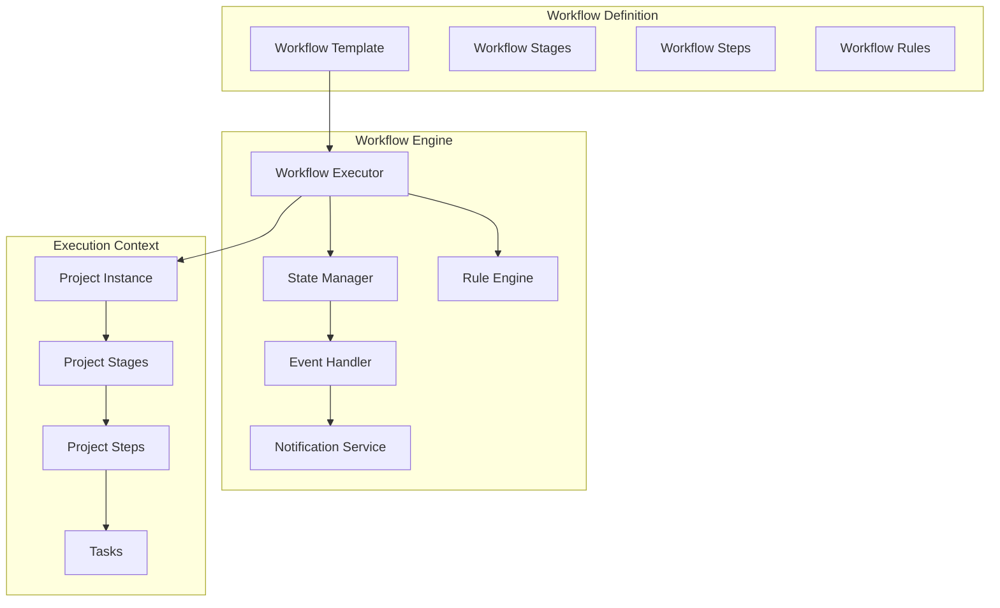
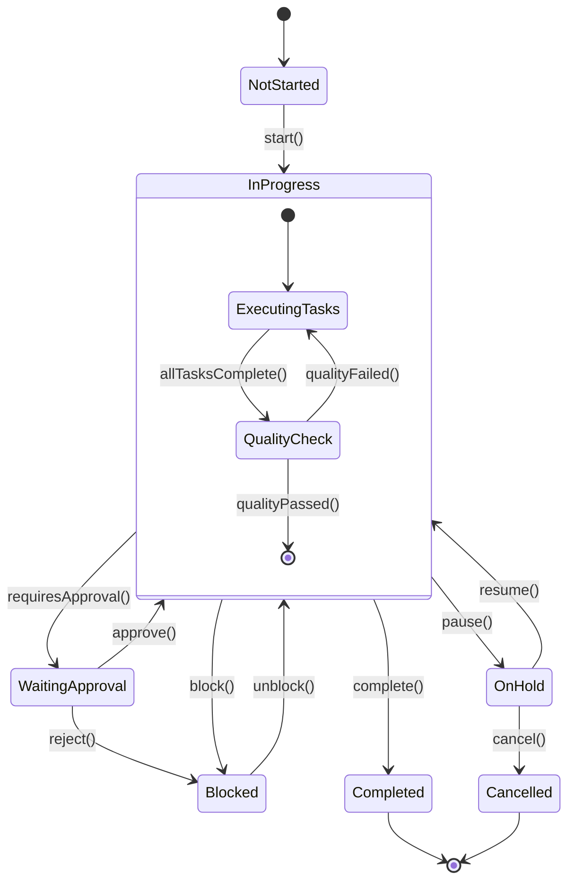

# Workflow Engine Implementation Design

## 1. Overview

The workflow engine is the core component that manages the execution of construction project workflows. It provides flexibility to define custom workflows while maintaining consistency in execution and state management.

## 2. Core Components

### 2.1 Workflow Engine Architecture



### 2.2 State Machine Design



## 3. Implementation Classes

### 3.1 Core Workflow Engine

```java
@Component
@Slf4j
public class WorkflowEngine {
    
    private final WorkflowExecutor workflowExecutor;
    private final StateManager stateManager;
    private final RuleEngine ruleEngine;
    private final EventPublisher eventPublisher;
    
    public WorkflowExecutionResult executeWorkflow(WorkflowExecutionRequest request) {
        try {
            // Validate workflow execution prerequisites
            validateExecution(request);
            
            // Execute workflow based on current state
            WorkflowExecutionContext context = createExecutionContext(request);
            WorkflowExecutionResult result = workflowExecutor.execute(context);
            
            // Update state and publish events
            stateManager.updateState(context, result);
            publishWorkflowEvents(context, result);
            
            return result;
        } catch (WorkflowException e) {
            log.error("Workflow execution failed", e);
            handleWorkflowError(request, e);
            throw e;
        }
    }
    
    public boolean canExecuteTransition(UUID projectId, WorkflowTransition transition) {
        WorkflowExecutionContext context = getExecutionContext(projectId);
        return ruleEngine.evaluateTransitionRules(context, transition);
    }
}
```

### 3.2 Workflow Executor

```java
@Component
public class WorkflowExecutor {
    
    private final Map<WorkflowActionType, WorkflowActionHandler> actionHandlers;
    private final WorkflowStateValidator stateValidator;
    
    public WorkflowExecutionResult execute(WorkflowExecutionContext context) {
        WorkflowAction action = context.getAction();
        
        // Validate current state allows this action
        stateValidator.validateStateTransition(context.getCurrentState(), action);
        
        // Get appropriate handler for the action
        WorkflowActionHandler handler = actionHandlers.get(action.getType());
        if (handler == null) {
            throw new UnsupportedWorkflowActionException(action.getType());
        }
        
        // Execute the action
        return handler.handle(context);
    }
}
```

### 3.3 State Manager

```java
@Component
@Transactional
public class StateManager {
    
    private final ProjectStageRepository projectStageRepository;
    private final ProjectStepRepository projectStepRepository;
    private final TaskRepository taskRepository;
    private final AuditService auditService;
    
    public void updateState(WorkflowExecutionContext context, WorkflowExecutionResult result) {
        switch (result.getTargetLevel()) {
            case PROJECT:
                updateProjectState(context, result);
                break;
            case STAGE:
                updateStageState(context, result);
                break;
            case STEP:
                updateStepState(context, result);
                break;
            case TASK:
                updateTaskState(context, result);
                break;
        }
        
        // Audit the state change
        auditService.logStateChange(context, result);
    }
    
    private void updateStageState(WorkflowExecutionContext context, WorkflowExecutionResult result) {
        ProjectStage stage = context.getProjectStage();
        StageStatus newStatus = result.getNewStatus();
        
        stage.setStatus(newStatus);
        stage.setUpdatedAt(Instant.now());
        
        if (newStatus == StageStatus.IN_PROGRESS && stage.getActualStartDate() == null) {
            stage.setActualStartDate(LocalDate.now());
        } else if (newStatus == StageStatus.COMPLETED) {
            stage.setActualEndDate(LocalDate.now());
            // Auto-start next stage if configured
            autoStartNextStage(stage);
        }
        
        projectStageRepository.save(stage);
    }
}
```

### 3.4 Rule Engine

```java
@Component
public class RuleEngine {
    
    private final List<WorkflowRule> workflowRules;
    private final RuleEvaluator ruleEvaluator;
    
    public boolean evaluateTransitionRules(WorkflowExecutionContext context, WorkflowTransition transition) {
        List<WorkflowRule> applicableRules = workflowRules.stream()
            .filter(rule -> rule.appliesTo(context, transition))
            .collect(Collectors.toList());
        
        return applicableRules.stream()
            .allMatch(rule -> ruleEvaluator.evaluate(rule, context));
    }
    
    public List<WorkflowRule> getBlockingRules(WorkflowExecutionContext context, WorkflowTransition transition) {
        return workflowRules.stream()
            .filter(rule -> rule.appliesTo(context, transition))
            .filter(rule -> !ruleEvaluator.evaluate(rule, context))
            .collect(Collectors.toList());
    }
}
```

### 3.5 Workflow Action Handlers

```java
// Base handler interface
public interface WorkflowActionHandler {
    WorkflowExecutionResult handle(WorkflowExecutionContext context);
    WorkflowActionType getSupportedActionType();
}

// Stage start handler
@Component
public class StartStageHandler implements WorkflowActionHandler {
    
    @Override
    public WorkflowExecutionResult handle(WorkflowExecutionContext context) {
        ProjectStage stage = context.getProjectStage();
        
        // Validate prerequisites
        validateStagePrerequisites(stage);
        
        // Create project steps from workflow template
        createProjectSteps(stage);
        
        // Update stage status
        return WorkflowExecutionResult.builder()
            .success(true)
            .targetLevel(WorkflowLevel.STAGE)
            .newStatus(StageStatus.IN_PROGRESS)
            .message("Stage started successfully")
            .build();
    }
    
    private void validateStagePrerequisites(ProjectStage stage) {
        // Check if previous stages are completed
        List<ProjectStage> previousStages = getPreviousStages(stage);
        boolean allPreviousCompleted = previousStages.stream()
            .allMatch(s -> s.getStatus() == StageStatus.COMPLETED);
        
        if (!allPreviousCompleted) {
            throw new WorkflowValidationException("Previous stages must be completed first");
        }
        
        // Check resource availability
        validateResourceAvailability(stage);
    }
    
    @Override
    public WorkflowActionType getSupportedActionType() {
        return WorkflowActionType.START_STAGE;
    }
}
```

## 4. Workflow Configuration

### 4.1 Workflow Template Configuration

```java
@Entity
@Table(name = "workflow_templates")
public class WorkflowTemplate {
    @Id
    private UUID id;
    
    private String name;
    private String description;
    private String category;
    private boolean active;
    private boolean isDefault;
    
    @OneToMany(mappedBy = "workflowTemplate", cascade = CascadeType.ALL)
    @OrderBy("orderIndex")
    private List<WorkflowStage> stages;
    
    @Embedded
    private WorkflowConfiguration configuration;
}

@Embeddable
public class WorkflowConfiguration {
    private boolean allowParallelExecution;
    private boolean autoProgressEnabled;
    private boolean qualityCheckRequired;
    private boolean customerApprovalRequired;
    private int maxConcurrentStages;
    
    @Convert(converter = JsonConverter.class)
    private Map<String, Object> customSettings;
}
```

## 5. Event-Driven Communication

### 5.1 Workflow Events

```java
// Base workflow event
@Data
@AllArgsConstructor
public abstract class WorkflowEvent {
    private UUID projectId;
    private UUID userId;
    private Instant timestamp;
    private String eventType;
}

// Specific workflow events
public class StageStartedEvent extends WorkflowEvent {
    private UUID stageId;
    private String stageName;
}

public class StageCompletedEvent extends WorkflowEvent {
    private UUID stageId;
    private String stageName;
    private Duration actualDuration;
}

public class WorkflowBlockedEvent extends WorkflowEvent {
    private String blockingReason;
    private List<String> requiredActions;
}
```

### 5.2 Event Handlers

```java
@Component
@EventListener
public class WorkflowEventHandler {
    
    private final NotificationService notificationService;
    private final ReportingService reportingService;
    
    @EventListener
    @Async
    public void handleStageStarted(StageStartedEvent event) {
        // Send notifications to relevant users
        notificationService.notifyStageStarted(event);
        
        // Update project timeline
        updateProjectTimeline(event.getProjectId());
        
        // Log for reporting
        reportingService.recordStageStart(event);
    }
    
    @EventListener
    @Async
    public void handleStageCompleted(StageCompletedEvent event) {
        // Send completion notifications
        notificationService.notifyStageCompleted(event);
        
        // Update project progress
        updateProjectProgress(event.getProjectId());
        
        // Generate completion report
        reportingService.generateStageCompletionReport(event);
    }
    
    @EventListener
    public void handleWorkflowBlocked(WorkflowBlockedEvent event) {
        // Immediate notification for blocked workflows
        notificationService.notifyWorkflowBlocked(event);
        
        // Escalate if needed
        escalateBlockedWorkflow(event);
    }
}
```

## 6. Workflow Rules Framework

### 6.1 Rule Types

```java
public enum RuleType {
    PREREQUISITE,      // Must be satisfied before action
    VALIDATION,        // Validates current state
    BUSINESS_LOGIC,    // Custom business rules
    APPROVAL,          // Approval requirements
    RESOURCE,          // Resource availability
    TIMING             // Time-based constraints
}

public interface WorkflowRule {
    boolean appliesTo(WorkflowExecutionContext context, WorkflowTransition transition);
    boolean evaluate(WorkflowExecutionContext context);
    String getFailureMessage();
    RulePriority getPriority();
    RuleType getRuleType();
}
```

### 6.2 Built-in Rules

```java
// Sequential execution rule
@Component
public class SequentialStageRule implements WorkflowRule {
    
    @Override
    public boolean evaluate(WorkflowExecutionContext context) {
        ProjectStage currentStage = context.getProjectStage();
        WorkflowStage workflowStage = currentStage.getWorkflowStage();
        
        if (workflowStage.isParallelExecution()) {
            return true;
        }
        
        return getPreviousStages(currentStage).stream()
            .allMatch(stage -> stage.getStatus() == StageStatus.COMPLETED);
    }
    
    @Override
    public RuleType getRuleType() {
        return RuleType.PREREQUISITE;
    }
}

// Resource availability rule
@Component
public class ResourceAvailabilityRule implements WorkflowRule {
    
    private final ResourceService resourceService;
    
    @Override
    public boolean evaluate(WorkflowExecutionContext context) {
        ProjectStep step = context.getProjectStep();
        WorkflowStep workflowStep = step.getWorkflowStep();
        
        List<String> requiredSkills = workflowStep.getRequiredSkills();
        return resourceService.areSkillsAvailable(
            context.getProject().getId(), 
            requiredSkills, 
            step.getStartDate(), 
            step.getEndDate()
        );
    }
    
    @Override
    public RuleType getRuleType() {
        return RuleType.RESOURCE;
    }
}
```

## 7. Workflow API Integration

### 7.1 REST Endpoints

```java
@RestController
@RequestMapping("/api/v1/workflow")
@PreAuthorize("hasRole('PROJECT_MANAGER') or hasRole('ADMIN')")
public class WorkflowController {
    
    private final WorkflowEngine workflowEngine;
    private final WorkflowService workflowService;
    
    @PostMapping("/projects/{projectId}/stages/{stageId}/start")
    public ResponseEntity<WorkflowExecutionResult> startStage(
            @PathVariable UUID projectId,
            @PathVariable UUID stageId,
            @RequestBody WorkflowActionRequest request) {
        
        WorkflowExecutionRequest executionRequest = WorkflowExecutionRequest.builder()
            .projectId(projectId)
            .stageId(stageId)
            .action(WorkflowAction.START_STAGE)
            .userId(getCurrentUserId())
            .metadata(request.getMetadata())
            .build();
        
        WorkflowExecutionResult result = workflowEngine.executeWorkflow(executionRequest);
        return ResponseEntity.ok(result);
    }
    
    @PostMapping("/projects/{projectId}/steps/{stepId}/complete")
    public ResponseEntity<WorkflowExecutionResult> completeStep(
            @PathVariable UUID projectId,
            @PathVariable UUID stepId,
            @RequestBody StepCompletionRequest request) {
        
        WorkflowExecutionRequest executionRequest = WorkflowExecutionRequest.builder()
            .projectId(projectId)
            .stepId(stepId)
            .action(WorkflowAction.COMPLETE_STEP)
            .userId(getCurrentUserId())
            .completionData(request.getCompletionData())
            .build();
        
        WorkflowExecutionResult result = workflowEngine.executeWorkflow(executionRequest);
        return ResponseEntity.ok(result);
    }
    
    @GetMapping("/projects/{projectId}/transitions")
    public ResponseEntity<List<AvailableTransition>> getAvailableTransitions(
            @PathVariable UUID projectId) {
        
        List<AvailableTransition> transitions = workflowService.getAvailableTransitions(projectId);
        return ResponseEntity.ok(transitions);
    }
}
```

## 8. Configuration and Customization

### 8.1 Workflow Template Builder

```java
@Service
public class WorkflowTemplateBuilder {
    
    public WorkflowTemplate createResidentialBuildTemplate() {
        return WorkflowTemplate.builder()
            .name("Standard Residential Build")
            .category("RESIDENTIAL")
            .stages(Arrays.asList(
                createStage("Site Preparation", 1, Arrays.asList(
                    createStep("Site Survey", 1),
                    createStep("Permits & Approvals", 2),
                    createStep("Site Clearing", 3)
                )),
                createStage("Foundation", 2, Arrays.asList(
                    createStep("Excavation", 1),
                    createStep("Footings", 2),
                    createStep("Foundation Pour", 3),
                    createStep("Foundation Inspection", 4)
                )),
                createStage("Framing", 3, Arrays.asList(
                    createStep("Floor Framing", 1),
                    createStep("Wall Framing", 2),
                    createStep("Roof Framing", 3),
                    createStep("Frame Inspection", 4)
                ))
                // ... more stages
            ))
            .configuration(WorkflowConfiguration.builder()
                .allowParallelExecution(false)
                .autoProgressEnabled(true)
                .qualityCheckRequired(true)
                .customerApprovalRequired(true)
                .build())
            .build();
    }
}
```

### 8.2 Dynamic Workflow Modification

```java
@Service
public class WorkflowModificationService {
    
    public void addCustomStep(UUID projectId, UUID stageId, WorkflowStepRequest stepRequest) {
        // Validate permissions
        validateModificationPermissions(projectId);
        
        // Create custom step
        ProjectStep customStep = createCustomStep(stageId, stepRequest);
        
        // Insert into workflow
        insertStepIntoWorkflow(customStep);
        
        // Publish modification event
        publishWorkflowModificationEvent(projectId, customStep);
    }
    
    public void skipStep(UUID projectId, UUID stepId, String reason) {
        // Validate skip permissions
        validateSkipPermissions(projectId, stepId);
        
        // Update step status
        ProjectStep step = projectStepRepository.findById(stepId)
            .orElseThrow(() -> new EntityNotFoundException("Step not found"));
        
        step.setStatus(StepStatus.SKIPPED);
        step.setNotes(reason);
        
        projectStepRepository.save(step);
        
        // Check if stage can progress
        checkStageProgression(step.getProjectStage());
    }
}
```

## 9. Performance Considerations

### 9.1 Async Processing

```java
@Configuration
@EnableAsync
public class WorkflowAsyncConfig {
    
    @Bean(name = "workflowExecutor")
    public TaskExecutor workflowExecutor() {
        ThreadPoolTaskExecutor executor = new ThreadPoolTaskExecutor();
        executor.setCorePoolSize(5);
        executor.setMaxPoolSize(20);
        executor.setQueueCapacity(100);
        executor.setThreadNamePrefix("workflow-");
        executor.initialize();
        return executor;
    }
}

@Service
public class AsyncWorkflowService {
    
    @Async("workflowExecutor")
    public CompletableFuture<WorkflowExecutionResult> executeWorkflowAsync(
            WorkflowExecutionRequest request) {
        
        WorkflowExecutionResult result = workflowEngine.executeWorkflow(request);
        return CompletableFuture.completedFuture(result);
    }
}
```

### 9.2 Caching Strategy

```java
@Service
@CacheConfig(cacheNames = "workflow")
public class WorkflowCacheService {
    
    @Cacheable(key = "#projectId")
    public WorkflowExecutionContext getExecutionContext(UUID projectId) {
        // Build and return execution context
    }
    
    @CacheEvict(key = "#projectId")
    public void invalidateWorkflowCache(UUID projectId) {
        // Cache will be evicted automatically
    }
}
```

This workflow engine design provides a flexible, scalable foundation for managing construction project workflows with proper state management, rule evaluation, and event-driven communication.